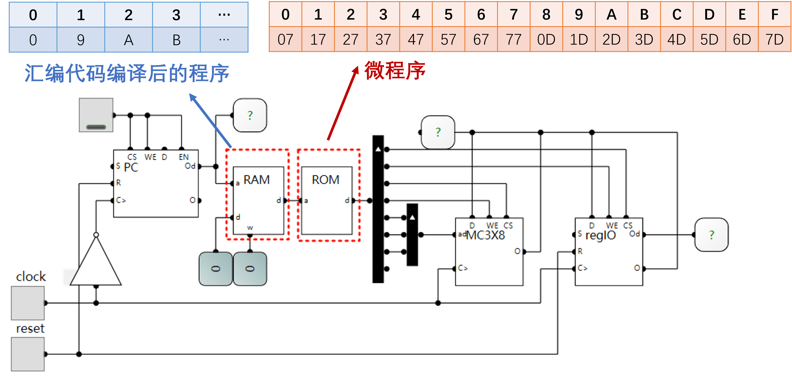
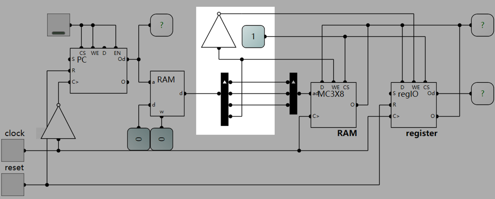
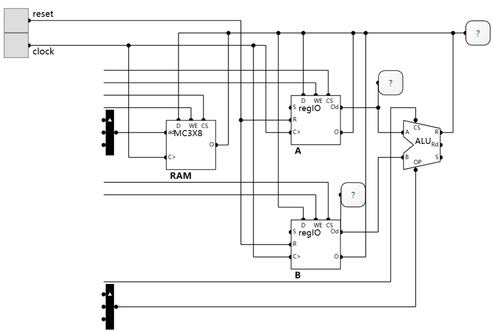
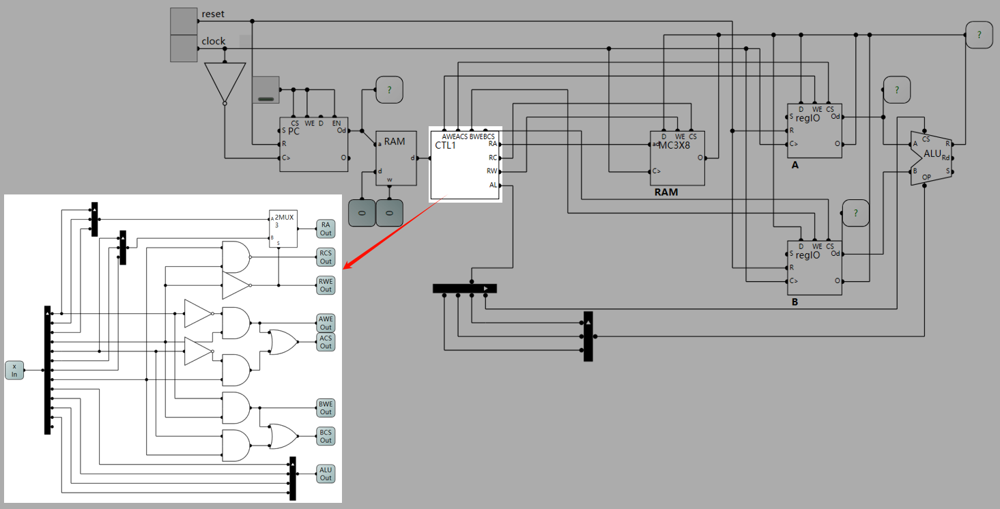
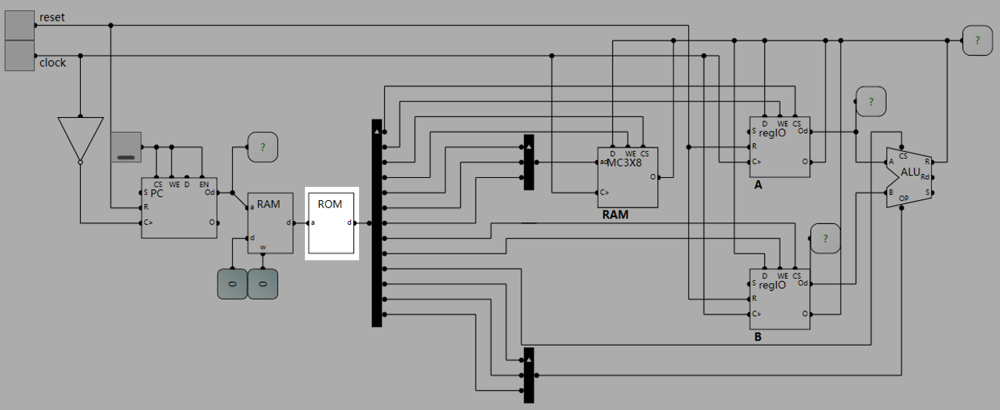

### 第三章  控制单元

*XSUN@GZHU
2026/05/06*

通过前两章的学习，我们已经了解了计算机组成的基本部件：算术逻辑单元(ALU), 寄存器(register)，程序计数器(program counter)和存储(memory)。我们现在已经具备搭建一个CPU的所有部件，但是我们仍然不知道如何将他们连接在一起，从而组成一个可用的计算机(可用 means 图灵完备)：


将这些部件有机地连接在一起形成一个冯诺依曼架构的计算系统就是本章的重点 - 控制。 何为控制？控制，就是为各个硬件提供有效的信号(就是之前章节所学到的诸如`CS`,`WE`等)，以使得硬件完成特点的功能。

#### 控制指令

所谓控制指令，就是抽象出的控制信号的有效取值，使得对应信号线上的逻辑电平符合电路功能的特定要求。如下图所示的电路中`control`的值就是控制指令：


对于这个电路，其有一个8bit寄存器，还有一个3bit地址线的8bit数据的RAM( $2^3 \times $ 8bit = 8byte容量),他们的数据输入和输出都连接在数据总线上，因此该电路能够实现的基本功能比较简单：要么将RAM中某个地址的数据写入寄存器，要么将寄存器中的输入写入到RAM中的某个地址。

比如，如上图所示，当`control = 0b00010111 = 0x17`时，按照电路的连接方式，`REG-CS=1,REG-WE=1, RAM-CS=1, RAM-WE=0, RAM-ADDR=0b001`，根据我们[第二章](../Chapter-2/readme.md)所学的内容，此时RAM处于读状态，寄存器处于写状态，那么RAM的数据输出口`RAM-O`和寄存器的数据输入口`REG=D`是连接在总线上的(当然，RAM的数据输入口`RAM-D`也连接在总线上，但由于寄存器处于读状态，数据输入是没有用的)，因此在时钟的上升沿，RAM地址1处的值就会写入寄存器中。

对于上述电路来说，控制指令`0x17`对于的电路功能，就是将RAM地址为1处的值写入RAM。同理，我们可以找到这个电路的所有有效控制指令及其对应的功能，一供16种（16 = 8 + 8， 8个RAM地址写入寄存器，或者寄存器写入8个RAM地址）。

你可能会想：如果我想把RAM地址0的值写入到RAM地址1，2，3处，如何实现呢？因为RAM在电路功能上不可能同时处于读状态和写状态（因为写使能信号`WE`要么为0，要么为1）。怎么办？我们可以利用寄存器做一个中转，先把RAM地址0的值写入到寄存器，再将寄存器中的值写入到RAM地址1，2，3处。如此，我们需要按照顺序给`control`赋值，另一方面，我们知道计算机是在时钟的引导下工作的。因此，我们能不能用一种方式，让此电路自动完成上述动作，而我们只需要给它提供时钟信号？

你想到了什么？还记得第二章中我们所学的程序计数器和存储单元吗？程序计数器可以在时钟上升沿自增，而存储单元可以存储我们想要赋给`control`的值，这样我们就可以用程序计数器生成访问存储单元的地址，在时钟的驱动下，赋给`control`的值就会按顺序从存储单元中弹出。于是我们有了下面这个电路：


注意，时钟信号接了一个非门后送入PC的时钟输入端，这样做的原因是让PC能够在时钟的下降沿自增1，而后续的RAM和寄存器的读写则在时钟上升沿完成，这样一个时钟周期内，就可以先完成PC更新，再完成硬件电路的功能实现。如上图所示，ROM中就可以存放我们想让电路依次完成的功能所对应的`control`取值，亦即：`0x07 0x1D 0x2D 0x3D`
|地址|0|1|2|3
|-|-|-|-|-|
|值|**0x07** (RAM0 $\to$ REG)|**0x1D**(REG $\to$ RAM1)|**0x2D**(REG $\to$ RAM2)|**0x3D**(REG $\to$ RAM3)|

电路上电复位后，PC的值为0，则ROM的地址输入端为0，则ROM的输出为地址0处的值为`0x07`，因此`control=0x07`，所以电路的功能为：下一个时钟上升沿时将RAM0的值写入寄存器。当我们点击一下`clock`，则`clock`信号的变化为`0 -> 1 -> 0`：会先产生一个上升沿`0 -> 1`，这时RAM0的值写入寄存器，然后会有一个下降沿`1 -> 0`，这时PC自增1(注意PC的`CS/WE/EN`都等于1,PC处于自增状态)。

#### 微程序控制
上述方式固然可行，但是两周之后，你会忘记TMD`0x07`和`0x2D`到底是什么意思来着！因为这个东西它是面向计算机硬件的，不是面向人类的，我们应当用人类的方式来记录指令的功能，用一种human-friendly的对硬件进行想要的操控。介于上述电路只有两种基本功能，我们可以把从RAM读数据写入寄存器记作`load`，而把寄存器的值写入RAM记作`store`，那么"把RAM地址0的值写入到RAM地址1，2，3处", 可以表示为：
```asm
load 0
store 1
store 2
store 3
```
这就是最简单的汇编语句(assembly).使用人类自然语言描述电路的功能，但人能看懂了，机器看不懂了（机器只认识0和1）。因此，我们还需要把上述代码按照某种规则转化成二进制，也就是**机器码(machine code)**，也就是机器指令。

这里我们用4bit二进制来编码：
|3|2|1|0|
|-|-|-|-|
|0:load <br> 1:store|RAM地址2|RAM地址1|RAM地址0|

用最高位表示是load还是store,用第三位表示RAM的地址（也正好是3位），按照此规则，我们就可以将汇编代码转换成机器码：
|汇编代码|机器码(bin)|
|-|-|
|`load 0`|`0000`|
|`store 1`|`1001`|
|`store 2`|`1010`|
|`store 3`|`1011`|

这一转换过程可以看作一个简易的**编译(compiling)**过程。

下面一个自然是，如何将机器码和我们的电路功能（控制指令）建立关系呢？如：
|汇编代码|机器码(bin)|控制指令(hex)|
|-|-|-|
|`load 0`|`0000`|0x07|
|`store 1`|`1001`|0x1D|

这种关系的建立本质上是在寻找一种实现**映射(map)**的方法，在计算机系统中，我们往往利用**存储器的地址与值**来实现映射关系。所以我们可以将该电路对应的所有控制指令存在一个存储器中，然后用机器码作为地址得到对应的控制指令，比如: 存储器地址为`0b1001`(十六进制`0x9`)处应当存放的控制指令为`0x1D`。这样我们用如下的电路：



RAM（注意：这个RAM是红色虚线框所标的RAM，不是MC3X8中的RAM）中存放的是汇编程序编译后得到的机器码，ROM中存放的控制指令，也就是微程序。这种实现计算机硬件控制的方式就是**微程序控制(micro-programmed control)**。

这样，这个系统就变成了一个**可编程(programmable)** 系统，我们只需要改写存储机器码的RAM就可以上电路在上电后执行不同的功能，而这个RAM中的机器码是由编译器产生的，因此，我们只用编写汇编语言，就可以操作这个电路了，而编译器/机器码/微程序便成为了从人到机器的桥梁。

#### 硬布线控制

由汇编后的机器码产生正确的控制信号，除了使用微程序控制外，还有一种方式，就是硬布线（hardwired）。所谓硬布线，就是直接由机器码各个位的数值，通过组合逻辑电路，产生正确的硬件电路控制信号的过程。

对于我们这个电路的例子来说，使用硬布线是很简单的，因为4bit机器码的最高位决定了RAM/寄存器的读写状态，也即`RAM-WE`和`REG-WE`是0还是1的问题。`RAM-WE`和`REG-WE`一定是互反的，因为其中一个读，势必意味着另外一个是写（电路中没有其他硬件部件了，这也意味者`RAM-CS`和`REG-CS`都为1）。所以我们可以直接使用机器码的最高位连接到MC3X8的`WE`，然后取反之后连接到寄存器的`WE`。而机器码的后三位直接连接到MC3X8的地址即可：



上图中高亮的部分就是硬布线实现的控制单元。

可见，在我们这个电路例子中，它是比微程序简单很多的，那么为什么还要有微程序的方式呢？下面让我们看一个稍微复杂些的例子。


#### 微程序与硬布线的比较



对于这个电路，相比于上一个电路，多出了一个寄存器和一个逻辑运算单元。那么，电路的功能丰富了起来，控制数值`control`的位宽自然也就多了起来：2个寄存器和RAM存储的和`WE`和`CS`就需要`2x3=6`位，然后RAM的地址位3位，ALU的`CS`和3位操作码`OP`，所以对于这个电路来说，其所需要的控制数值位宽要大于等于`6+3+1+3=13`。

如果我们现在只考虑寄存器和RAM之间的数据流转，那么可能的功能为：`RAM -> A`、`RAM -> B`、`A -> RAM`、`A -> B`、`B -> RAM`、`B -> A`共6类。所以对应的可能的汇编语句为：
```asm
MOV 1, A
MOV 1, B
MOV A, 1 
MOV A, B
MOV B, 1
MOV B, A
```
而RAM的地址可以取`0~7`，因此我们可以用4bit的二进制来表示我们“可存储数据”的单元，即: `0b0000~0b0111`表示RAM， `0b1000`表示`A`, `0b1001`表示`B`。这样我们的两个操作数共需要8位二进制说来表示。我们再用5位二进制数来表示`MOV`和其他的一些电路功能（比如ALU中的加减等）。
> 注意：这里用几位去编码操作数是任意的，理论上要大于4位，因为ALU的OP就有3位了，我们还要MOV功能

这样的我们就有了把汇编语言转化成二进制机器码(command,简写CMD)的编码规则，例如：
|汇编|二进制|功能|正确的硬件信号|
|-|-|-|-|
|MOV 1, A|0b 00000 0001 1000|读RAM地址1处的值写入寄存器A|`A-CS=1,A-WE=1,B-CS=0,B-WE=0,R-CS=1,R-WE=0,R-Addr=001`|
|MOV A, 1|0b 00000 1000 0001|读寄存器A的值写入RAM地址1处|`A-CS=1,A-WE=0,B-CS=0,B-WE=0,R-CS=1,R-WE=1,R-Addr=001`|
|MOV A, B|0b 00000 1000 1001|读寄存器A的值写入寄存器B|`A-CS=1,A-WE=0,B-CS=1,B-WE=1,R-CS=1,R-WE=0,R-Addr=001`|

定义好了汇编规则，接下来就需要由汇编转化后的二进制机器码产生正确的控制信号来控制硬件的功能。
|汇编|机器码CMD|正确的硬件信号|
|-|-|-|
|MOV 1, A|0b 00000 0001 1000|`A-CS=1,A-WE=1,B-CS=0,B-WE=0,R-CS=1,R-WE=0,R-Addr=001`|
|MOV A, 1|0b 00000 1000 0001|`A-CS=1,A-WE=0,B-CS=0,B-WE=0,R-CS=1,R-WE=1,R-Addr=001`|
|MOV A, B|0b 00000 1000 1001|`A-CS=1,A-WE=0,B-CS=1,B-WE=1,R-CS=1,R-WE=0,R-Addr=001`|

通过上面的讲解，我们知道，实现这样的转化有两种方式：硬布线和微程序。我们先来看硬布线：

##### 硬布线
首先分析读写A寄存器的情况，如果需要读写A寄存器，则代表A寄存器的二进制`0b1000`要么出现在CMD的低4位，即`CMD[3:0]=1000`,此时为**写A寄存器**，或者出现CMD的中间4位，即`CMD[7:4]=1000`，此时为**读A寄存器**。这两种情况下，A寄存器的片选`CS`信号等于1，因此我们可以得到`A-CS`的逻辑表达式：
`A-CS = (CMD[3] and !CMD[0]) or (CMD[7] and !CMD[4])`, 而`A-WE = CMD[3] and !CMD[0]`（此时A寄存器为写状态）。
> 注意，这里我们没有去管CMD的2，3，5，6位，是因为对于我们的电路来说，这两位已不再关键，因为我们只需要区分RAM的0-7，A，B这10种数值。

同理，我们可以得到B寄存器的控制信号：
`B-CS = (CMD[3] and CMD[0]) or (CMD[7] and CMD[4])`, 而`B-WE = CMD[3] and CMD[0]`。和A寄存器进行比较可知，区别只在于`CMD[0]`和`CMD[4]`是否需要取反，因为对于我们的规定，`CMD[0]`或`CMD[4]`等于0时才表示A，`CMD[0]`或`CMD[4]`等于1时表示B。

同理，我们可以得到RAM的控制信号：`RAM-CS = not (CMD[3] and CMD[7])`,这里的想法是：如果`CMD[3] and CMD[7] = 1`, 那么两个操作数的值都大于1，显然已经超过RAM0-7的地址，所以此时RAM没有参与到数据流转种，那么它的逆命题就是RAM参与了，因此此时其片选信号应等于1。而RAM的写使能信号久只有在`CMD[3]=0`时取1，因为此时CMD的低4位的值一定小于等于`0b0111`，还是表征RAM的地址。最后，对于RAM的地址信号，当RAM为写时RAM的地址`RAM-Addr = CMD[2:0]`, 否则应当取`RAM-Addr=CMD[6:4]`，所以可以使用一个3位的2选1数据选择器来实现。

综上，硬布线的逻辑电路如下：



注意，上述电路还未考虑ALU的控制情况，大家可以自行尝试。

##### 微程序
当然，我们可以使用微程序的方式控制这个电路的功能，也即在电路中加入一个ROM，请为这个ROM的地址位宽和数据位宽分别为多少？

答案应为存储微程序的ROM的地址位宽位13（操作码5+操作数4+操作数4），数据位宽为13(因为有13个需要给值的控制信号)。我们把ROM加入到电路种：



下面要解决的问题，就是在ROM的地址处填入正确的13位二进制数值。比如对于汇编代码：`MOV A, 1`, 那么它转化成机器码: `0b0000010000001`, 那ROM的地址`0b0000010000001=0x0081`处的值应当为`0b0000000011101`，因为这样的取值，对于上述硬件电路来说，使得`A-CS=1,A-WE=0,B-CS=0,B-WE=0,R-CS=1,R-WE=1,R-Addr=001`,这正是我们所需要的控制信号。

##### 微程序vs.硬布线
如果，现在我们给电路新增一个寄存器C，那么将会给我们上述的微程序于硬布线的设计方案带来怎样的影响。
+ 硬布线：全部需要重新设计。
+ 微程序：只需要修改ROM种的值，整个电路不用动。

由此，大家可以看到微程序和硬布线的不同特点，总结如下表：
||硬布线|微程序|
|-|-|-|
|修改/新增功能|重新设计逻辑电路|修改存储器内容|
|设计难度|难|容易|
|执行速度|快|较慢|
|使用场景|固定/精简指令集|复杂指令集|

现代CPU采用混合式架构比较多，简单、高频的指令（如整数加减、逻辑运算、常用加载指令）通过硬布线实现，复杂、不常用的指令（如某些浮点运算、系统管理指令）则交给微程序（微代码）去解释执行。

---
#### CPU的呼唤
针对上面的电路，我们只对MOV功能(即在存储器间搬运数据)进行了设计和实现，而真正的CPU支持很多功能，比如将A寄存器种的值与RAM地址为2处的值相加结果存储在A寄存器中，其汇编代码可以为：`ADD A, 2`。但是你会发现，这似乎也可以表达将A寄存器种的值+2，结果存储在A寄存器中。所以，可能更规范的写法为:
+ `ADD A, [2]`表示加RAM地址2处的值
+ `ADD A, 2`表示加数字2
那么，我们的汇编器如何识别和编码，对应的硬件电路又当如何设计？这就涉及到了CPU的指令集和指令周期等概念，也就自然而然地进入到我们地下一章的内容。

---

#### 本章小结

1. 控制的本质是**产生正确有效的硬件电路的控制信号**，从而让硬件正确地工作，实现用户想要实现的功能。

2. 计算机是使用者是人类，以人类友好方式（human-friendly）使用计算机是我们的诉求，因此我们发明了更贴近人类自然语言的**汇编语言**，但是计算机不懂人类语言，所以我们需要将**汇编语言**转化成计算机能识别的**机器语言**，也就是二进制数。这个转化过程就叫做编译，完成这种编译的工具叫做汇编器。

3. 我们需要将1和2连接起来，也就是用由汇编语言编译而来的机器语言产生正确的硬件控制信号。我们可以用**硬布线**和**微程序控制**两种方法来完成这个任务。

4. 硬布线设计起来困难，但运行速度更快。微程序较为简单，但是又存储器的参与，运行速度较慢。鱼和熊掌不可兼得！

有了前三章作为基础，下面我们就可以正式进入CPU的设计之旅了！