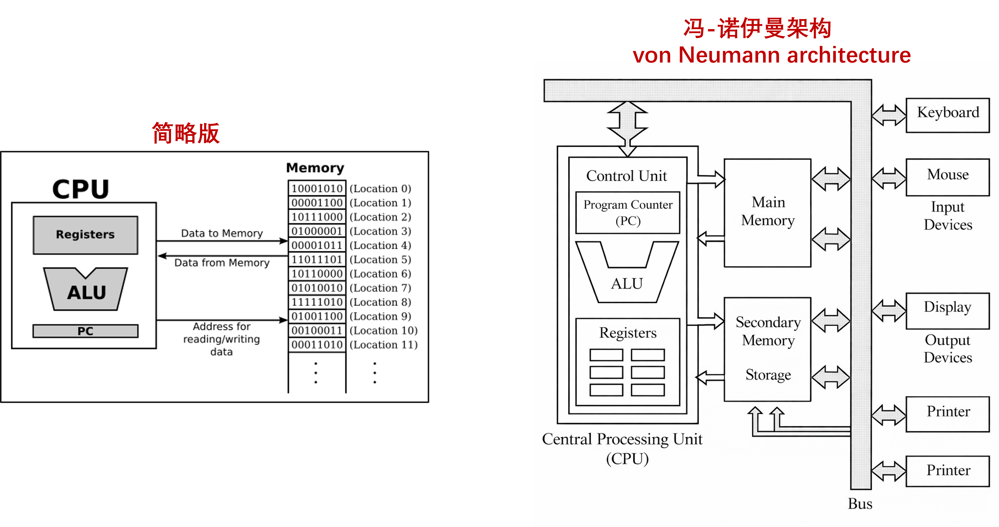
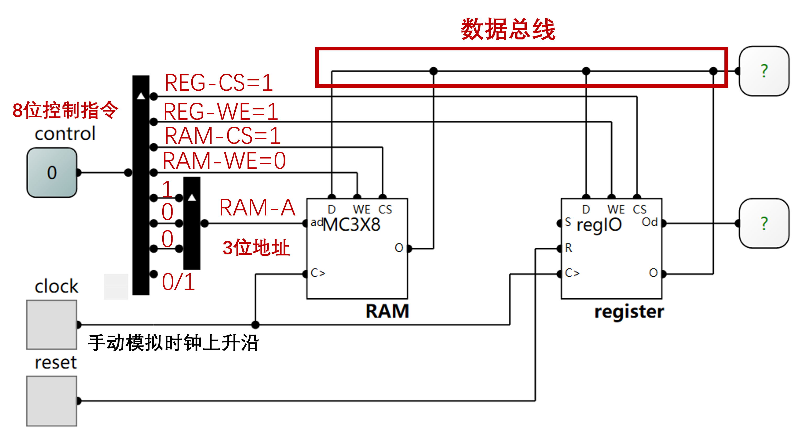
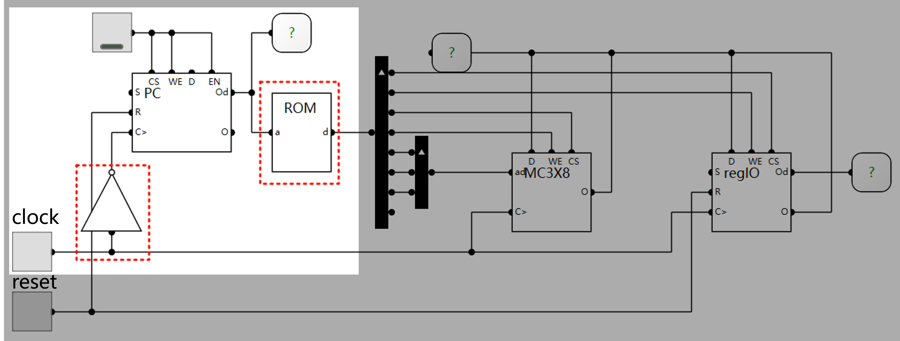

### 第三章  控制单元

*孙学龙，广州大学
2026/05/06*

通过前两章的学习，我们已经了解了计算机组成的基本部件：算术逻辑单元(ALU), 寄存器(register)，程序计数器(program counter)和存储(memory)。我们现在已经具备搭建一个CPU的所有部件，但是我们仍然不知道如何将他们连接在一起，从而组成一个可用的计算机(可用 means 图灵完备)：

将这些部件有机地连接在一起形成一个冯诺依曼架构的计算系统就是本章的重点 - 控制。 何为控制？控制，就是为各个硬件提供有效的信号(就是之前章节所学到的诸如`CS`,`WE`等)，以使得硬件完成特点的功能。

#### 控制指令

所谓控制指令，就是抽象出的控制信号的有效取值，使得对应信号线上的逻辑电平符合电路功能的特定要求。如下图所示的电路中`control`的值就是控制指令：

对于这个电路，其有一个8bit寄存器，还有一个3bit地址线的8bit数据的RAM( $2^3 \times $ 8bit = 8byte容量),他们的数据输入和输出都连接在数据总线上，因此该电路能够实现的基本功能比较简单：要么将RAM中某个地址的数据写入寄存器，要么将寄存器中的输入写入到RAM中的某个地址。

比如，如上图所示，当`control = 0b00010111 = 0x17`时，按照电路的连接方式，`REG-CS=1,REG-WE=1, RAM-CS=1, RAM-WE=0, RAM-ADDR=0b001`，根据我们[第二章](../Chapter-2/readme.md)所学的内容，此时RAM处于读状态，寄存器处于写状态，那么RAM的数据输出口`RAM-O`和寄存器的数据输入口`REG=D`是连接在总线上的(当然，RAM的数据输入口`RAM-D`也连接在总线上，但由于寄存器处于读状态，数据输入是没有用的)，因此在时钟的上升沿，RAM地址1处的值就会写入寄存器中。

对于上述电路来说，控制指令`0x17`对于的电路功能，就是将RAM地址为1处的值写入RAM。同理，我们可以找到这个电路的所有有效控制指令及其对应的功能，一供16种（16 = 8 + 8， 8个RAM地址写入寄存器，或者寄存器写入8个RAM地址）。

你可能会想：如果我想把RAM地址0的值写入到RAM地址1，2，3处，如何实现呢？因为RAM在电路功能上不可能同时处于读状态和写状态（因为写使能信号`WE`要么为0，要么为1）。怎么办？我们可以利用寄存器做一个中转，先把RAM地址0的值写入到寄存器，再将寄存器中的值写入到RAM地址1，2，3处。如此，我们需要按照顺序给`control`赋值，另一方面，我们知道计算机是在时钟的引导下工作的。因此，我们能不能用一种方式，让此电路自动完成上述动作，而我们只需要给它提供时钟信号？

你想到了什么？还记得第二章中我们所学的程序计数器和存储单元吗？程序计数器可以在时钟上升沿自增，而存储单元可以存储我们想要赋给`control`的值，这样我们就可以用程序计数器生成访问存储单元的地址，在时钟的驱动下，赋给`control`的值就会按顺序从存储单元中弹出。于是我们有了下面这个电路：

注意，时钟信号接了一个非门后送入PC的时钟输入端，这样做的原因是让PC能够在时钟的下降沿自增1，而后续的RAM和寄存器的读写则在时钟上升沿完成，这样一个时钟周期内，就可以先完成PC更新，再完成硬件电路的功能实现。如上图所示，ROM中就可以存放我们想让电路依次完成的功能所对应的`control`取值，亦即：`0x07 0x1D 0x2D 0x3D`
|地址|0|1|2|3
|-|-|-|-|-|
|值|**0x07** (RAM0 $\to$ REG)|**0x1D**(REG $\to$ RAM1)|**0x2D**(REG $\to$ RAM2)|**0x3D**(REG $\to$ RAM3)|

电路上电复位后，PC的值为0，则ROM的地址输入端为0，则ROM的输出为地址0处的值为`0x07`，因此`control=0x07`，所以电路的功能为：下一个时钟上升沿时将RAM0的值写入寄存器。当我们点击一下`clock`，则`clock`信号的变化为`0 -> 1 -> 0`：会先产生一个上升沿`0 -> 1`，这时RAM0的值写入寄存器，然后会有一个下降沿`1 -> 0`，这时PC自增1(注意PC的`CS/WE/EN`都等于1,PC处于自增状态)。

