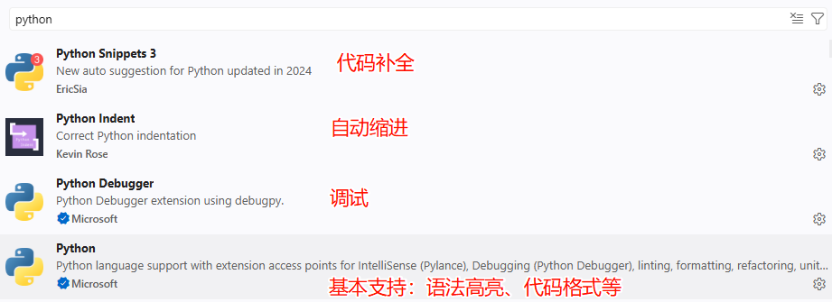
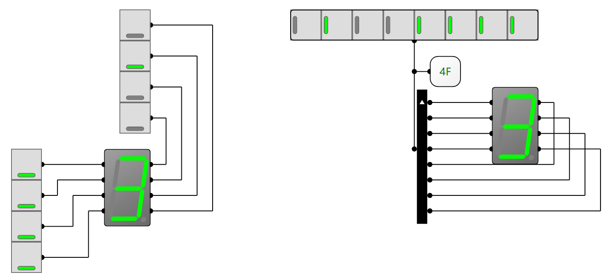
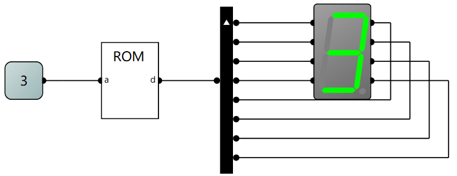
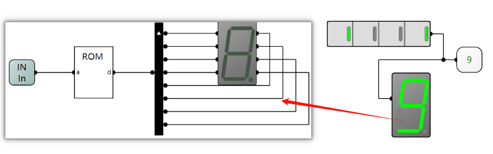
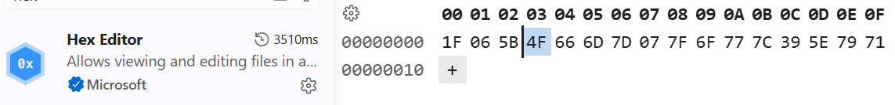
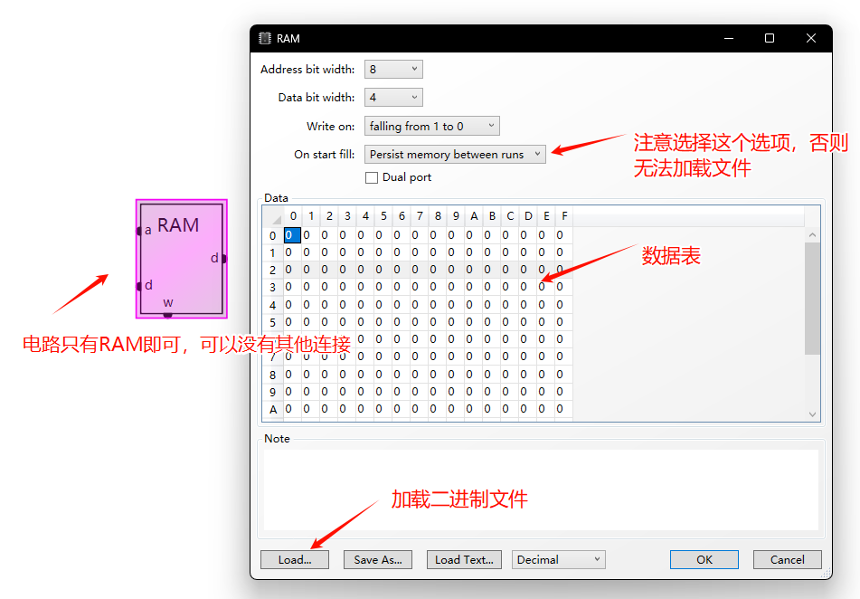
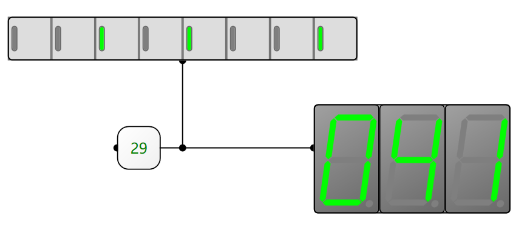
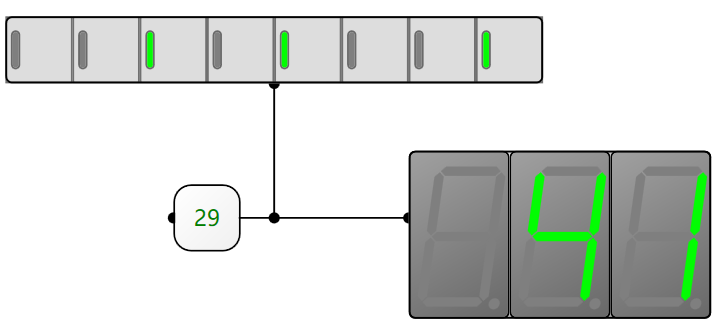

### Lab 2 — Python basics for PCO and 7-segment display
### 实验2 — 面向计组的Python基础和7段数码管

*2025-2026-2 Principal of Computer Organization
XSUN@GZHU*

#### 1. Goal / 实验目标:
完成本实验后，能够：
1. 下载，安装Python并运行Python脚本
2. 理解和使用Python的基本数据结构：变量，列表和字典
3. 理解和使用Python的分支与循环，函数定义，模块管理
4. 使用Python进行字符串处理和文件读写
5. 使用外部文件给LogicCircuit中的RAM/ROM写入数值
6. 学会使用LogicCircuit的7段数码管

#### 2. Knowledge / 知识点：
##### 2.1 Python Basic / Python 基础
+ 下载和安装[Python 3.x](https://www.python.org/)
+ 在VSCode中安装Python插件:
  
+ 运行第一个Python程序
  新建一个`hello_world.py`文件，写入以下内容：
  ```python
  print('Hello World')
  ```
  点击vscode右上角的三角形符号运行，会在终端打印字符串`Hello World`。

  当然，你可以在命令行中运行Python:

  ```shell
  python hello_world.py
  ```
+ \* 使用 [Jupyter Notebook](https://jupyter.org/) 交互式运行 Python
  + 网页版
  + VSCode插件 + IPython
 
+ 基本类型：变量，字符串，列表，字典
  > Python是动态语言，不需要指定变量类型
  ```py
  a = 1 # 变量
  a = "a" # 字符
  a = "a is a string" # 字符串，单引和双引号均可
  a = [1,2,3,4] # 列表
  print(a[0]) # 列表从0开始索引
  print(a[0:2]) # 可以用":"进行数组切片，会打印1，2，3，4 
  a = {'name':'张三','job':'律师','age':16} # 字典：键-值对
  print(a['name']) # 由键访问值
  ```
+ 分支
  > Python对**缩进**的要求非常严格，这几乎是Python解释器最重要的判断语法格式的途径，所有缩进一定要正确
  ```py
  a = 1
  if a > 1:
    print("a>1")
  elif a == 1:
    print("a==1")
  else:
    print("a<1")
  ```
+ 循环
  ```py
  # for loop
  for i in [1,2,3,4]:
    print(i)
  # while loop
  a = 6
  while a > 1:
    print(a)
    a = a - 1
  ```
+ 函数
  ```py
  def func(x, y):
    return x + y
  func(2, 3)
  ```
+ 模块管理
  有点像C语言里面的`#include`, 比如你现在有一个`module.py`文件：
  ```py
  CNT = 12
  def func(x):
    return x**2
  ```
  现在，在**同一个目录**下你新建一个`test.py`,并且想引用`module.py`中的变量，常量，函数等，需要用到`import` 语法：
  ```py
  from module import CNT, func
  # 使用导入的功能
  print(func(CNT))
  ```
  或者：
  ```py
  import module as m
  print(m.func(m.CNT))
  ```
+ 字符串
  在Python中我们使用单引号`''`，或者双引号`""`来表示一个字符串：
  ```python
  s = "Hello PCO"
  s2 = 'Hello World'
  s3 = "I'm a Boy"
  ```
  字符串本质是是一个字符列表，因此可以进行索引：
  ```python
  s = "Hello PCO"
  c = s[2] # c = 'l'
  ```
+ 文件读写
  因为我们最终的项目需要先写一个汇编代码`.asm`，我们需要用Python把这个汇编代码转成机器码（汇编文件`.asm` $\to$ 二进制文件`.bin`），我们再把二进制文件加载到我们自制计算机的RAM中。这里涉及到利用Python读取`.asm`(读文件)然后经过处理生成`.bin`文件(写文件)。
  
  在Python中读取文件使用如下语法：
  ```py
  fd = open("filename", "r") #filename是文件名, "r"表示"read"

  # fd是一个文件描述符，为了更好地获取和回收fd我们一般使用Python的上下文
  with open("filename", "r") as fd:
    data = fd.readlines()
  ```
  写文件也是利用文件描述符的上下文：
  ```py
  # "wb" 表示二进制(binary)写(write)，默认从文件头开始写
  # "+" 如果该文件不存在，则创建，如果存在，删除原有内容后再写
  with open("filename", "wb+") as fd:
    data = fd.readlines()
  ```
  > ps: 请善于利用AI帮助你快速学习Python语法。AI时代，任何编程语言的语法已不再重要，重要的是：出色的想法、巧妙的数据结构思维，以及对计算机底层的理解！

##### 2.2 数码管
+ 基本原理
    数码管就是将LED灯排列成"8."字型(实际上加上小数点有8个LED)，用0/1来控制LED的亮灭。在LogicCircuit中我们可以用简单地开关测试以下数码管的显示规则：

    

    然后我们可以用一个8位的二进制数去控制数码管的显示。如上右图可知，当我们使用"**最低位接入数码管左上的引脚，然后逆时针依次排到右上**"这样的接法：如果我显示数字3，则应给的二进制数为`0x4F`。这本质上是一种映射(map), 我们可以用刚刚学过的Python字典的键值对来表示这种映射：
    ```py
    segment_map = {3: '0x4F'}
    ```
    同理，我们可以构建其他数字的映射，考虑到一个数码管，可以显示'0~F'，也就是正好对应一个4位二进制数，也就是说：**一个数码管可以显示一位十六进制。** 天啊，这是巧合，还是天意？！
    ```py
    segment_map = {
            0: "",
            1: "",
            2: "", 
            3: "0x4F", 
            4: "",
            5: "",
            6: "",
            7: "",
            8: "",
            9: "",
            10: "", # A
            11: "", # B
            12: "", # C
            13: "", # D
            14: "", # E
            15: "" # F
        }
    ```
    在LogicCircuit中，如何在电路上实现这种映射，使得我们输入`0x03`就让数码管显示`3`呢？这是不是有点像控制单元中的微程序，给一个机器指令，就输出想要的控制信号？对的，我们这里也可以使用存储器ROM/RAM来实现，因为存储器完成的是**由地址到值得映射**:

    

    上图中ROM（地址：4bit， 数据：8bit）地址`0x3`处的值为`0x4F`。

    我们可以把上述电路进行封装（Sample Shape选择Display），就可以实现输入什么数值就显示什么数值了:

    

+ Python生成存储器镜像
    把正确的数值依次填入数码管可能过于麻烦，当我们有了Python后，便可以把上述`segment_map`写入二进制文件，然后在LogicCircuit中导入文件即可：
    ```python
    # 数据写入函数
    def write_segment_4bit_hex_rom(filename):
        """
        Write the 7-segment display representations for all 4-bit values (0-15)
        to a binary file.
        
        Args:
            filename (str): The name of the binary file to write to.
        """
        with open(filename, "wb+") as f:
            for i in range(16):
                seg_hex = segment_map[i]
                # 先转换成10进制，然后转成1字节二进制序列（byteorder='big':大端序）
                f.write(int(seg_hex, 16).to_bytes(1, byteorder='big'))
    # 调用这个函数
    write_segment_4bit_hex_rom('seg-4bit-hex.bin')
    ```
    我们可以使用VSCode插件**Hex Editor**来非常舒适地编辑和浏览二进制文件：

    

#### 3. 实验任务

##### 任务1：简易汇编器
用Python实现一个简易的汇编器, 将内容如下的汇编代码文件`code.asm`：
```asm
Load 0
Store 1
Load 1
Store 2
Store 3
```
编译成一个二进制文件`code.bin`(编译规则自定，比如4bit二进制对应一行语句，最高位表示`Load/Store`, 第三位表示地址)，并**导入到LogicCircuit的RAM中**：。


要求：
+ 给出完整python代码
+ 给出LogicCircuit的RAM数据表的截图（如上图所示）
+ 此任务需提交:`code.asm`，`compiler.py`,`code.bin`文件

##### 任务2：十进制数码管的实现
在LogicCircuit中实现一个显示0~255的十进制数码管显示器：



要求：
+ 给出电路实现和测试样例
+ 给出生成ROM镜像的Python完整代码。
+ 此任务需提交：LogicCircuit工程文件，Python文件

##### 任务3（选做）：

改进任务2的数码管，如果该位没有数值，则数码管不显示0，而显示灰色：



#### 4. 实验报告提交
把：
1. LogicCircuit 工程文件 (`*.CircuitProject`)；
2. Python文件，bin文件，asm文件
3. `PCO_Lab2_姓名.md`；
4. `images/` 中的截图；

压缩成 `PCO_Lab2_姓名.zip`，邮件发送到`xsun@gzhu.edu.cn`,邮件主题：`PCO-Lab2-Assignment`

截止日期（过期提交无成绩）: **2026年5月19日（第12周周二）前**。

#### 5. 报告评分标准

| 评分项 | 权重 | 说明 |
|---|---:|---|
| 目标与概念解释 | 30% | 能清楚解释简易汇编编译器和数码管显示的基本原理和实现方法 |
| 电路设计与测试 | 10% | 数码管电路设计和测试正确且完整 |
| 程序编写 | 25% | Python代码撰写正确且规范 |
| Markdown 质量 | 15% | 章节、表格、图片和格式清晰 |
| 反思 | 20% | 能说明遇到的问题、调试方法和收获 |